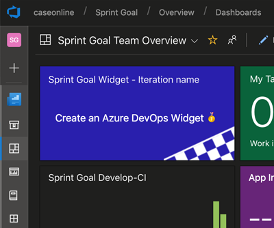

# VSTS Sprint Goal

This extension enables you to set a goal for your sprint in VSTS.

## Usage

First you set your goal (screenshot 1), a goal is set per sprint (or 'iteration') and optionally per team if multiple teams share the same sprint.

After setting the goal, the goal will be shown in the tab-label on every page within the sprint (screenshot 2)

## Release notes

### Version 3.3 - 14-10-2018

- Solved [#12](https://github.com/keesschollaart81/vsts-sprint-goal/issues/12) and [#13](https://github.com/keesschollaart81/vsts-sprint-goal/issues/13)

### Version 3.0 - 01-03-2018

- Added Widget

  
- <b>Important notice</b>: because of this widget, this update requires approval. You have to go to 'manage extensions' and authorize this update before it becomes available!
- Support for <b>TFS 2018</b> / On-Premises (email me when having problems / let me know your context so that I can reproduce)

### Version 2.0 - 20-08-2017

- Support for multiple team working on the same iteration. The first team setting the goal, sets it both on iteration level as well on team level. After this all teams share this initial goal but can set their own if they want to
- Removed limit of 60 characters
- Added emoji picker

### Version 1.0 - 02-06-2017

Initial Release

## Known Bugs

- First time someone (else) loads the sprint page, the sprint goal is not shown in the tab label.
- New navigation (summer '18) does not refresh the pages when switching team/sprint. Tab does not get updated.

## Privacy

Sprint Goal uses Application Insights to track telemetry. When: 'sprint form page loaded', 'sprint saved', data: the id's (guids) of the account, project and user.

## Contact

Experiencing problems, or do you have an idea? 
Please let me know via [Twitter](https://twitter.com/keesschollaart) or by [mail](mailto:keesschollaart81@hotmail.com).