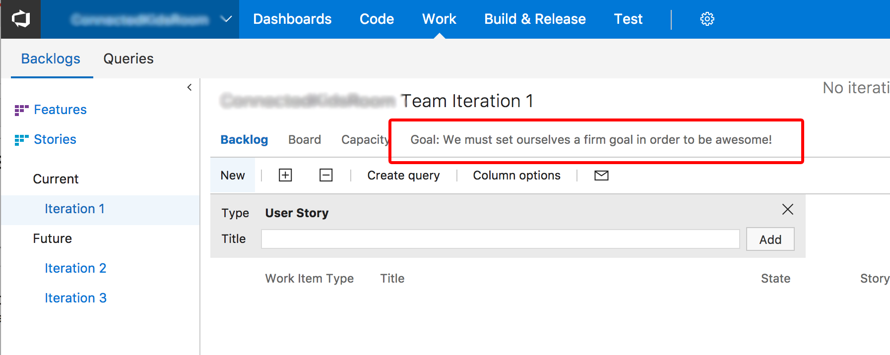

# VSTS Sprint Goal

This extension enables you to set a goal for your sprint in VSTS.

## Screenshots

First you set your goal (per sprint/iteration):

After setting the sprint goal, the goal can is shown in the tabname on every page within a sprint (backlog, board and capacity):

## Known Bugs

- First time someone (else) loads the sprint page, the sprint goal is not shown in the tab label.
- Tab title does not work in TFS (VSTS Only) and also only works when cookies are available

## Links

[VSTS Marketplace](https://marketplace.visualstudio.com/items?itemName=keesschollaart.sprint-goal)

[Github](https://github.com/keesschollaart81/vsts-sprint-goal)

