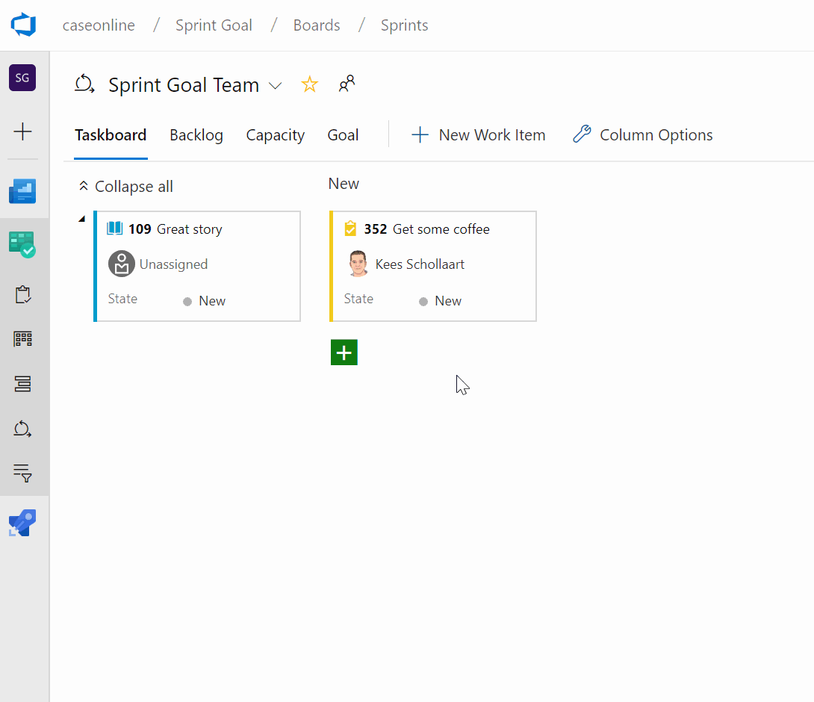

# Azure DevOps - Sprint Goal

This extension enables you to set a goal for your sprint in Azure DevOps.
 

# Links

[Azure DevOps Marketplace](https://marketplace.visualstudio.com/items?itemName=keesschollaart.sprint-goal)
